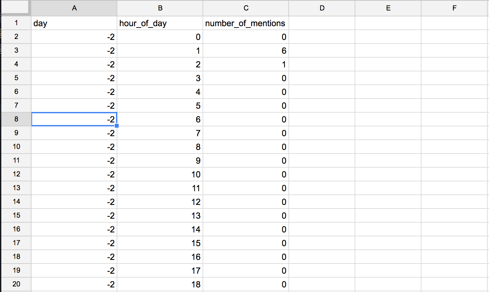

A Particle Emmiter
=================

##### What is this?


For a [story about online trolling](https://www.buzzfeed.com/lamvo/heres-what-it-feels-like-to-be-trolled-in-trumps-america), we at the BuzzFeed Open Lab put together an animated data visualization. This is the cleaned up code for this project.

##### What problem does this solve?
Visualizing more than a few thousand data points in d3.js can get a little heavy on the browser because you have to animate thousands of `<svg>` elements. Using `<canvas>` allows you to manipulate and update pixels instead.

##### Project background
The code for this project came from an in-class exercise for a JavaScript class. I’ve modified the project to make this graphic.

The original code is from [Eric Haseltine](https://twitter.com/erichaseltine), the JavaScript instructor who introduced me to the joy of canvas.

##### Dependencies

For this project you need `underscore.js` and `JQuery` for the counter. The canvas animation is written in `JavaScript`.

```
<script src="js/libs/jquery-2.1.3.min.js"></script>
<script src="js/libs/underscore-1.6.0.min.js" type="text/javascript" charset="utf-8"></script>
```

## How to use this

To make your own version of this project you will need to modify two of the files: the `data.js` and `script.js` files.

### Prepping the data

The animation and the ticker are based on three data points:
1. The `day` relative to when the trolling happened (days before or after, in full integers)
2. The `hour_of_day` measured in military time (0-24)
3. The `number_of_mentions` at that `hour_of_day` and on that `day`

You can prepare your data in any software or app that allows you to work with spreadsheets, like [Google Spreadsheets](https://spreadsheets.google.com/) or Excel. Your spreadsheet should look like this. Make sure to include rows for hours and days even if there were 0 Twitter mentions during that hour on that day.



Once you have prepped it, you can copy the cells and paste them into [this web tool](https://shancarter.github.io/mr-data-converter/) to convert your data into a `json` format.

Paste the new data into the `data.js` file after the bit that says `var data =` and erase the old data.

### The `script.js` file

First, you can set where on the screen you want the emitter to start by putting in numbers or ratios by changing the `originX` and `originY` values on line 32.

```
originX = SCREEN_WIDTH/2,
originY = SCREEN_HEIGHT/2,
```

You can change the `color` of the particles on line 36.
```
color = '#1da1f2';
```

The next step is a bit more cumbersome and could certainly be improved (by all means, do feel free to tinker with the code!) but given the time constraints and timeliness of the story we wanted to illustrate, we decided to go with brute force over elegance in code. If you're fine with my way, here's how you can customize the emitter for your purposes. Onwards! ( ´ ▽ \` )ﾉ

On line 133 and 142 you will find a lot of hard-coded (meaning repeated) lines that help you time your animation.

Here's line 133. What you'll see here is that the numbers show you how many milliseconds will have to elapse after you click the button before the emitter will go off.

```
if((currentTime - clickTime) >150){emitter1.animate()}
if((currentTime - clickTime) >300){emitter2.animate()}
if((currentTime - clickTime) >450){emitter3.animate()}
etc.
```

Line 14. In this line you make an emitter for each hour.

```
emitter1	= new Emitter(originX,originY, '#1da1f2',0);
emitter2	= new Emitter(originX,originY, '#1da1f2',1.2); emitter3	= new Emitter(originX,originY, '#1da1f2',0.2);
etc.
```

You will have to create an `emitter` (`emitter1`, `emitter2`, etc.) and an `if` clause for each row of your data set.

Last but not least, make sure you update which weekday you want the ticker to display in the if clauses below. Again. It's not the cleverest code, but it does the job!

```
// update the day counter
if (value.day == -2 || value.day == 5){
  $('#day').html('Tuesday')
} else if (value.day == -1 || value.day == 6){
  $('#day').html('Wednesday')
} else if (value.day == 0){
  $('#day').html('Thursday')
}else if (value.day == 1){
  $('#day').html('Friday')
}	else if (value.day == 2){
  $('#day').html('Saturday')
} else if (value.day == 3){
  $('#day').html('Sunday')
}	else if (value.day == 4){
  $('#day').html('Monday')
}
```

## How to run this project locally (for the nerds)

If you want to preview the graphic locally, you can do so by going to your Terminal. Navigate into your directory using `cd` and once you're there run a local server by running this command in your terminal `python -m SimpleHTTPServer`. To preview the graphic go to a browser of your choice and go to `localhost:8000`.

## Copyright
MIT License
Copyright 2017 BuzzFeed

Permission is hereby granted, free of charge, to any person obtaining a copy of this software and associated documentation files (the "Software"), to deal in the Software without restriction, including without limitation the rights to use, copy, modify, merge, publish, distribute, sublicense, and/or sell copies of the Software, and to permit persons to whom the Software is furnished to do so, subject to the following conditions:

The above copyright notice and this permission notice shall be included in all copies or substantial portions of the Software.

THE SOFTWARE IS PROVIDED "AS IS", WITHOUT WARRANTY OF ANY KIND, EXPRESS OR IMPLIED, INCLUDING BUT NOT LIMITED TO THE WARRANTIES OF MERCHANTABILITY, FITNESS FOR A PARTICULAR PURPOSE AND NONINFRINGEMENT. IN NO EVENT SHALL THE AUTHORS OR COPYRIGHT HOLDERS BE LIABLE FOR ANY CLAIM, DAMAGES OR OTHER LIABILITY, WHETHER IN AN ACTION OF CONTRACT, TORT OR OTHERWISE, ARISING FROM, OUT OF OR IN CONNECTION WITH THE SOFTWARE OR THE USE OR OTHER DEALINGS IN THE SOFTWARE.
